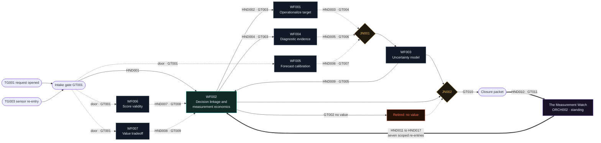
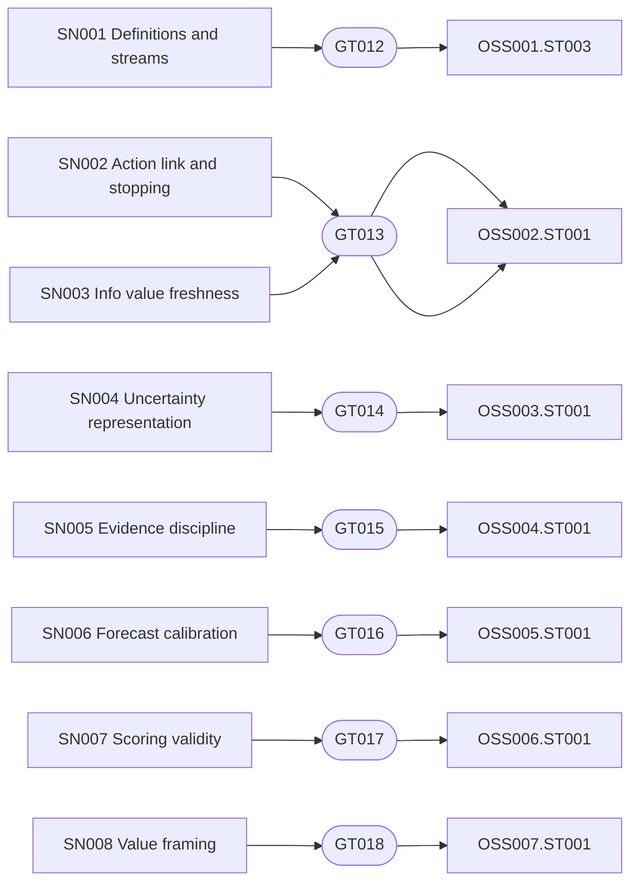

# The orchestrator circuit, human readable

Two machines and one loop. **The Measurement Engagement** (ORCH001,
Project role) runs bounded measurement work from intake to closure.
**The Measurement Watch** (ORCH002, Standing role) guards what closed
engagements built and reopens them with scoped fixes. The engagement
arms the watch on its way out; the watch re-enters the engagement when
a sensor trip clears a human gate. The circuit has no end state.

Line legend, used in both diagrams and the tables: **solid** edges are
gated handoffs, **dotted** edges are advisory feeds returning upstream
and the intake doors, **thick** edges are the standing layer (the arm at
close and the re-entry routes). Every gate on every edge is decided by a
human. The Mermaid blocks render in Obsidian and GitHub; the ASCII
schematic renders anywhere.

## The engagement circuit



The seven re-entries are drawn as one thick edge here to keep the
circuit readable; the watch board below and the re-entry table at the
end carry each route exactly.

## The watch board

Eight sensors, seven human escalation gates (GT013 is shared by the two
OSS002 sensors), seven re-entry states.



## ASCII schematic

```
TRIGGERS     TG001 request opened        TG003 sensor re-entry
                    \                       /
INTAKE            [ Intake gate GT001 ]
                    | HND001              . . . doors, GT001 . . .
HUB          [ WF002  decision linkage + measurement economics ]--GT002-->( retired: no value )
               | HND002 GT003   | HND004 GT003     .               .              .
INSTRUMENTS  [WF001 define]   [WF004 evidence]  [WF005 forecast] [WF006 score] [WF007 value]
               | HND003 GT004   | HND005 GT006    | HND006 GT007   | HND007 GT008 | HND008 GT009
JOIN                    { JN001 } --> [ WF003 uncertainty model ]    \_____________\__> back to HUB
LOOP         [ WF003 ] --HND009 GT005--> back to HUB   (model, value, measure, again)
CLOSE        { JN002 } --GT010--> [ closure packet ] ==HND010 GT011==> [[ THE MEASUREMENT WATCH ]]
STANDING     watch ==HND011..HND017==> scoped re-entry into the matching instrument, broken rung only
```

## Reading the circuit, leg by leg

The nine project phase legs, exactly as the handoff map records them:

| ID | Type | From | To | Gate | Carries |
|---|---|---|---|---|---|
| HND001 | gated_handoff | ORCH001 intake after GT001 | WF002 at OSS002.ST001 | GT001 | Measurement request and decision-use question; Candidate metric, report, target, claim, forecast, score, or value factor |
| HND002 | gated_handoff | WF002 at OSS002.ST002 | WF001 at OSS001.ST001 or OSS001.ST002 | GT003 | Decision-use record; Target clarification need; and 1 more |
| HND003 | advisory_feed | WF001 at OSS001.ST004 | WF003 at OSS003.ST001 | GT004 | Operational definition; Proxy-target linkage statement; and 2 more |
| HND004 | gated_handoff | WF002 at OSS002.ST003 | WF004 at OSS004.ST001 | GT003 | High-value uncertainty or claim; Decision-model context; and 1 more |
| HND005 | advisory_feed | WF004 at OSS004.ST003 | WF003 at OSS003.ST003 | GT006 | Interpreted diagnostic evidence; Comparison standard; and 1 more |
| HND006 | advisory_feed | WF005 at OSS005.ST004 | WF003 at OSS003.ST003 | GT007 | Validated forecast signal; Calibration or forecast error record; and 1 more |
| HND007 | advisory_feed | WF006 at OSS006.ST004 | WF002 at OSS002.ST003 | GT008 | Error-aware or standardized comparison output; Calibration coverage record; and 1 more |
| HND008 | advisory_feed | WF007 at OSS007.ST003 | WF002 at OSS002.ST003 | GT009 | Quantified decision tradeoff; Preference evidence trace; and 1 more |
| HND009 | gated_handoff | WF003 at OSS003.ST004 | WF002 at OSS002.ST003 or OSS002.ST004 | GT005 | Probabilistic scenario outcome; Input distribution record; and 1 more |

The arm:

| ID | Type | From | To | Gate | Carries |
|---|---|---|---|---|---|
| HND010 | arm | ORCH001 after GT010 and GT011 | ORCH002 standing watch | GT011 | Closure record; Decision log; and 2 more |

The seven re-entry routes:

| ID | Type | From | To | Gate | Carries |
|---|---|---|---|---|---|
| HND011 | re_entry | ORCH002 through SN001 | ORCH001 and WF001 recovery entry | GT012 | Stream-health alert or construct-drift alert; Current operational definition; and 1 more |
| HND012 | re_entry | ORCH002 through SN002 or SN003 | ORCH001 and WF002 recovery entry | GT013 | Action-link or stopping-discipline alert; Value-of-information freshness alert; and 1 more |
| HND013 | re_entry | ORCH002 through SN004 | ORCH001 and WF003 recovery entry | GT014 | Point-estimate relapse alert; Qualitative risk-label relapse alert; and 1 more |
| HND014 | re_entry | ORCH002 through SN005 | ORCH001 and WF004 recovery entry | GT015 | Completeness-demand or evidence-dismissal alert; Evidence protocol; and 1 more |
| HND015 | re_entry | ORCH002 through SN006 | ORCH001 and WF005 recovery entry | GT016 | Calibration-drift alert; Forecast validation failure alert; and 1 more |
| HND016 | re_entry | ORCH002 through SN007 | ORCH001 and WF006 recovery entry | GT017 | Compressed-score regression alert; Comparison calibration drift alert; and 1 more |
| HND017 | re_entry | ORCH002 through SN008 | ORCH001 and WF007 recovery entry | GT018 | Categorical value-framing alert; Preference evidence trace; and 1 more |

Three things on the diagram are not handoffs. The retire fork inside
WF002 is governed by GT002: if no possible answer would change the
decision, the measurement retires at OSS002.ST004, and retirement is a
success outcome. The three dotted doors from intake exist because the
GT001 boundary admits entry "to OSS002.ST001 or another workflow entry
state": forecast, score, and value shaped requests enter their
instruments directly, which is why no project handoff targets WF005,
WF006, or WF007. And the thin lines into the joins are the join
semantics themselves: JN001 merges instrument outputs before model and
information value use, JN002 merges the model's outcomes with the
stopping economics before a human closes.

## Sensor wiring, exact

| Sensor | Watches | Escalates to | Human gate name | Re-entry state |
|---|---|---|---|---|
| SN001 Operational definition and evidence stream decay sensor | OSS001.STM004, OSS001.STM005 | GT012 | Operational definition and stream decay escalation gate | OSS001.ST003 |
| SN002 Action link and stopping discipline sensor | OSS002.STM008, OSS002.STM010 | GT013 | Decision use and information value decay escalation gate | OSS002.ST001 |
| SN003 Information value freshness sensor | OSS002.STM009 | GT013 | Decision use and information value decay escalation gate | OSS002.ST001 |
| SN004 Uncertainty representation regression sensor | OSS003.STM005, OSS003.STM006 | GT014 | Uncertainty representation decay escalation gate | OSS003.ST001 |
| SN005 Partial evidence acceptance sensor | OSS004.STM004, OSS004.STM005 | GT015 | Partial evidence acceptance escalation gate | OSS004.ST001 |
| SN006 Forecast calibration and validation sensor | OSS005.STM006, OSS005.STM007 | GT016 | Forecast calibration and validation decay escalation gate | OSS005.ST001 |
| SN007 Scoring and invariance drift sensor | OSS006.STM004, OSS006.STM005 | GT017 | Scoring and comparison decay escalation gate | OSS006.ST001 |
| SN008 Categorical value framing sensor | OSS007.STM004 | GT018 | Value framing decay escalation gate | OSS007.ST001 |

## Provenance

Drawn entirely from the Stage 13 registry of run
RUN_HTMA_POOLED_CORPUS_20260731_151807. The interactive version, with every
element opening its full record in FORMAL and FELT registers, is the
Orchestration view of dhw_htma_corpus_explorer.html. The assertion
level ground truth, with checksums, is DHW.VERIF.HTMA.001.
